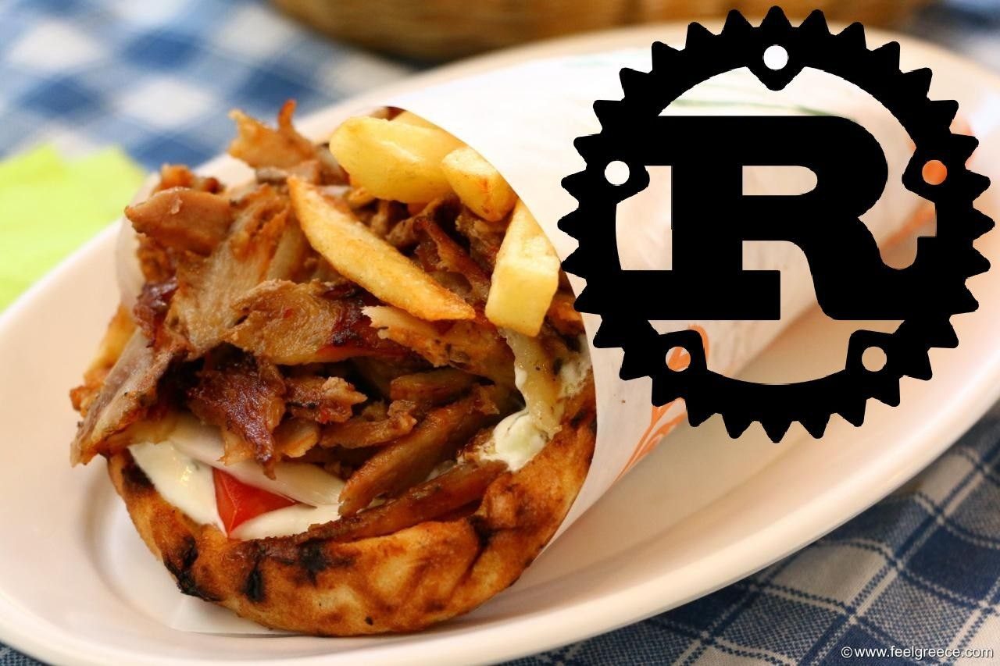

# skouriasmeno



Ελα τωρε, δεν χρειαζεται να πω κατι, ξες τωρα, _ψηλοκαταλαβες_

Κανε οτι θες, ΑΛΛΑ να θυμασαι οτι ΔΕΝ ξερω ραστ, οποτε ρωτα τον μητσοτακη για βοηθεια

Αν θες ενα τουτοριαλ:
```
skouriasmeno::skouriasmeno! {
    εξωτερικο κυβωτιο skouriasmeno;
    
    μεθοδος κυριο() {
        τυποσεγρμ!("Ε καλο ε;");
    }
}
```

## αυτη η μλκια αλλα σε αλλες γλωσσες:

- Dutch: [roest](https://github.com/jeroenhd/roest)
- German: [rost](https://github.com/michidk/rost)
- Polish: [rdza](https://github.com/phaux/rdza)
- Italian: [ruggine](https://github.com/DamianX/ruggine)
- Russian: [ржавчина](https://github.com/FluxIndustries/rzhavchina)
- Esperanto: [rustteksto](https://github.com/dscottboggs/rustteksto)
- Hindi: [zung](https://github.com/rishit-khandelwal/zung)
- Hungarian: [rozsda](https://github.com/jozsefsallai/rozsda)
- Chinese: [xiu (锈)](https://github.com/lucifer1004/xiu)
- Spanish: [rustico](https://github.com/UltiRequiem/rustico)
- Korean: [Nok (녹)](https://github.com/Alfex4936/nok)
- Finnish: [ruoste](https://github.com/vkoskiv/ruoste)
- Arabic: [sada](https://github.com/LAYGATOR/sada)
- Turkish: [pas](https://github.com/ekimb/pas)
- Vietnamese: [gỉ](https://github.com/Huy-Ngo/gir)
- Japanese: [sabi (錆)](https://github.com/yuk1ty/sabi)
- Danish: [rust?](https://github.com/LunaTheFoxgirl/rust-dk)
- Marathi: [gan̄ja](https://github.com/pranavgade20/ganja)
- Romanian: [rugină](https://github.com/aionescu/rugina)
- Czech: [rez](https://github.com/radekvit/rez)
- Ukrainian: [irzha](https://github.com/brokeyourbike/irzha)
- Bulgarian: [ryzhda](https://github.com/gavadinov/ryzhda)
- Slovak: [hrdza](https://github.com/TheMessik/hrdza)
- Catalan: [rovell](https://github.com/gborobio73/rovell)
- Corsican: [rughjina](https://github.com/aldebaranzbradaradjan/rughjina)
- Indonesian: [karat](https://github.com/annurdien/karat)
- Lithuanian: [rūdys](https://github.com/TruncatedDinosour/rudys)

ε καλο ε;
